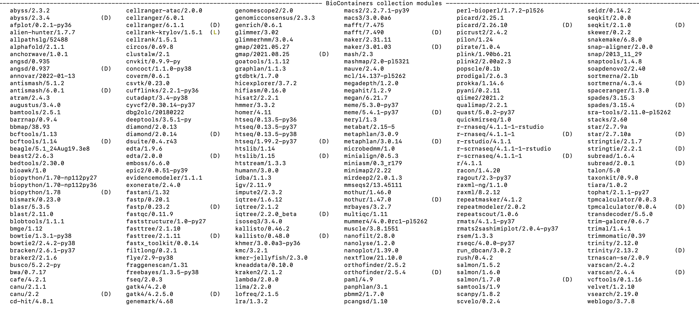

.. RCAC Biocontainers documentation master file, created by
   sphinx-quickstart on Wed Mar  2 21:59:37 2022.
   You can adapt this file completely to your liking, but it should at least
   contain the root `toctree` directive.

RCAC Biocontainers's documentation!
==============================================

.. toctree::
   :maxdepth: 3
   :caption: Software list
   :titlesonly:

   source/Alphafold/Alphafold
   source/HOMMER/HOMMER
   source/GTDB-Tk/GTDB-Tk
   source/HUMAnN3/HUMAnN3

Indices and tables
==================

* :ref:`genindex`
* :ref:`modindex`
* :ref:`search`
