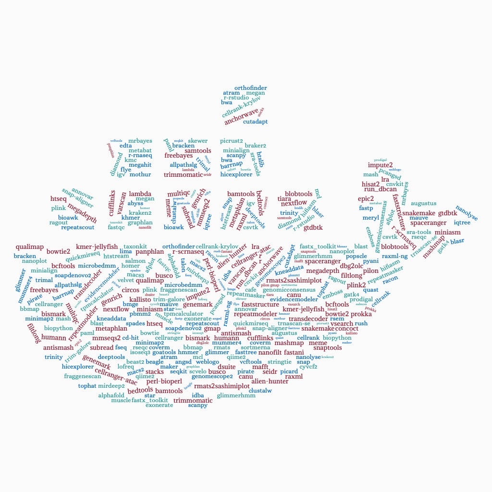

.. RCAC Biocontainers documentation master file, created by
   sphinx-quickstart on Wed Mar  2 21:59:37 2022.
   You can adapt this file completely to your liking, but it should at least
   contain the root `toctree` directive.

RCAC Biocontainers's documentation!
==============================================

This is the user guide for biocontainer modules deployed in Purdue High Performance Computing clusters. More information about our center is avaiable here (https://www.rcac.purdue.edu).  

If you have any questions, contact me at: 
`zhan4429@purdue.edu <mailto:zhan4429@purdue.edu>`_

.. toctree::
   :caption: Software list
   :maxdepth: 3
   :titlesonly:

   source/Alphafold/Alphafold
   source/AUGUSTUS/AUGUSTUS
   source/BRAKER2/BRAKER2
   source/GTDB-Tk/GTDB-Tk
   source/HOMMER/HOMMER
   source/HUMAnN3/HUMAnN3  
   source/MetaPhlAn3/MetaPhlAn3  
   source/run_dbcan/run_dbCAN
  
