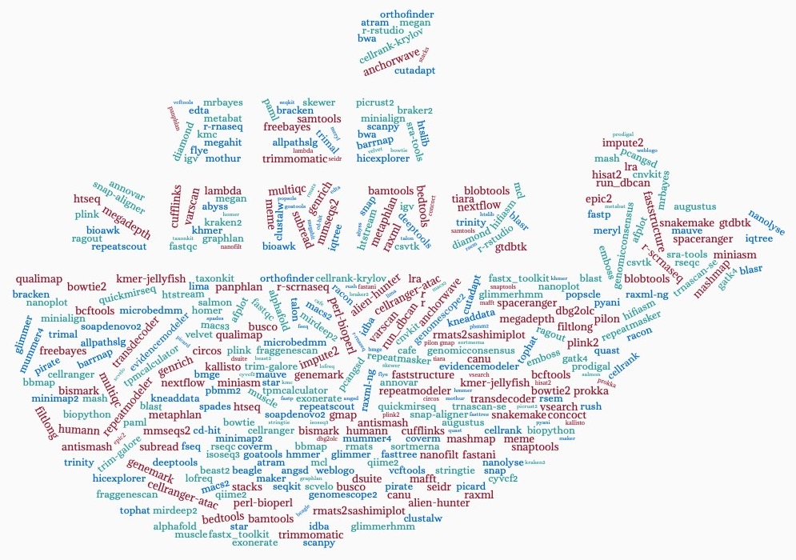

.. RCAC Biocontainers documentation master file, created by
   sphinx-quickstart on Wed Mar  2 21:59:37 2022.
   You can adapt this file completely to your liking, but it should at least
   contain the root `toctree` directive.

RCAC Biocontainers documentation!
==============================================

This is the user guide for biocontainer modules deployed in Purdue High Performance Computing clusters. More information about our center is avaiable here (https://www.rcac.purdue.edu).  

If you have any question, contact me(Yucheng Zhang) at: 
`zhan4429@purdue.edu <mailto:zhan4429@purdue.edu>`_

.. toctree::
   :caption: Application list
   :maxdepth: 3
   :titlesonly:
   
   source/abacas/abacas
   source/abyss/abyss
   source/advntr/advntr
   source/afplot/afplot
   source/afterqc/afterqc
   source/agat/agat
   source/alfred/alfred
   source/alien-hunter/alien-hunter
   source/allpathslg/allpathslg
   source/Alphafold/Alphafold
   source/amptk/amptk
   source/anchorwave/anchorwave
   source/ANGSD/ANGSD
   source/annovar/annovar
   source/antismash/antismash
   source/anvio/anvio
   source/assembly-stats/assembly-stats
   source/aTRAM/aTRAM
   source/augur/augur
   source/AUGUSTUS/AUGUSTUS
   source/bam-readcount/bam-readcount
   source/bamtools/bamtools
   source/bamutil/bamutil
   source/barrnap/barrnap
   source/basenji/basenji
   source/bbmap/bbmap
   source/bcftools/bcftools
   source/beagle/beagle
   source/beast2/beast2
   source/bedops/bedops
   source/bedtools/bedtools
   source/bioawk/bioawk
   source/biobambam/biobambam
   source/bioconvert/bioconvert
   source/biopython/biopython
   source/bismark/bismark
   source/blasr/blasr
   source/blast/blast
   source/blobtools/blobtools
   source/bmge/bmge
   source/bowtie/bowtie
   source/bowtie2/bowtie2
   source/bracken/bracken
   source/BRAKER2/BRAKER2
   source/brass/brass
   source/busco/busco
   source/bustools/bustools
   source/bwa/bwa
   source/cactus/cactus
   source/cafe/cafe
   source/canu/canu
   source/cd-hit/cd-hit
   source/cdbtools/cdbtools
   source/cellbender/cellbender
   source/cellranger/cellranger
   source/cellranger-atac/cellranger-atac
   source/CellRank/CellRank
   source/CellRank-krylov/CellRank-krylov
   source/celltypist/celltypist
   source/circlator/circlator
   source/circos/circos
   source/ciriquant/ciriquant
   source/clustalw/clustalw
   source/cnvkit/cnvkit
   source/cnvnator/cnvnator
   source/concoct/concoct
   source/control-freec/control-freec
   source/cooler/cooler
   source/coverm/coverm
   source/crisprcasfinder/crisprcasfinder
   source/crispritz/crispritz
   source/crossmap/crossmap
   source/csvtk/csvtk
   source/cufflinks/cufflinks
   source/cutadapt/cutadapt
   source/cyvcf2/cyvcf2
   source/dbg2olc/dbg2olc
   source/deepbgc/deepbgc
   source/deeptools/deeptools
   source/delly/delly
   source/diamond/diamond
   source/dnaio/dnaio
   source/drep/drep
   source/dropest/dropest
   source/dsuite/dsuite
   source/easysfs/easysfs
   source/edta/edta
   source/emboss/emboss
   source/epic2/epic2
   source/evidencemodeler/evidencemodeler
   source/exonerate/exonerate
   source/fasta3/fasta3
   source/fastani/fastani
   source/fastp/fastp
   source/fastq_pair/fastq_pair
   source/fastqc/fastqc
   source/fastspar/fastspar
   source/faststructure/faststructure
   source/fasttree/fasttree
   source/fastx_toolkit/fastx_toolkit
   source/filtlong/filtlong
   source/flye/flye
   source/fraggenescan/fraggenescan
   source/freebayes/freebayes
   source/fseq/fseq
   source/GATK4/GATK4
   source/GeneMark/GeneMark
   source/genomescope2/genomescope2
   source/genomicconsensus/genomicconsensus
   source/genrich/genrich
   source/gffcompare/gffcompare
   source/gffread/gffread
   source/glimmer/glimmer
   source/glimmerhmm/glimmerhmm
   source/gmap/gmap
   source/goatools/goatools
   source/graphlan/graphlan
   source/graphmap/graphmap
   source/gridss/gridss
   source/gseapy/gseapy
   source/GTDB-Tk/GTDB-Tk
   source/guppy/guppy
   source/hicexplorer/hicexplorer
   source/hifiasm/hifiasm
   source/hisat2/hisat2
   source/hmmer/hmmer
   source/HOMMER/HOMMER
   source/HUMAnN3/HUMAnN3
   source/htseq/htseq
   source/htslib/htslib
   source/htstream/htstream
   source/hyphy/hyphy
   source/idba/idba
   source/igv/igv
   source/impute2/impute2
   source/instrain/instrain  
   source/InterProScan/InterProScan
   source/iqtree/iqtree
   source/isoseq3/isoseq3
   source/kallisto/kallisto
   source/khmer/khmer
   source/kmc/kmc
   source/kmer-jellyfish/kmer-jellyfish
   source/kneaddata/kneaddata
   source/kraken2/kraken2
   source/krakentools/krakentools
   source/lambda/lambda
   source/last/last
   source/liftoff/liftoff
   source/lima/lima
   source/lofreq/lofreq
   source/lra/lra
   source/macs2/macs2
   source/macs3/macs3
   source/mafft/mafft
   source/MAKER/MAKER  
   source/mash/mash
   source/mashmap/mashmap
   source/mashtree/mashtree
   source/mauve/mauve
   source/mcl/mcl
   source/medaka/medaka
   source/megadepth/megadepth
   source/megahit/megahit
   source/megan/megan
   source/meme/meme
   source/meryl/meryl
   source/metabat/metabat
   source/MetaPhlAn3/MetaPhlAn3  
   source/microbedmm/microbedmm
   source/minialign/minialign
   source/miniasm/miniasm
   source/minimap2/minimap2
   source/mirdeep2/mirdeep2
   source/mitofinder/mitofinder
   source/mmseqs2/mmseqs2
   source/mothur/mothur
   source/mrbayes/mrbayes
   source/multiqc/multiqc
   source/mummer4/mummer4
   source/muscle/muscle
   source/nanofilt/nanofilt
   source/nanolyse/nanolyse
   source/nanoplot/nanoplot
   source/nanopolish/nanopolish
   source/nextalign/nextalign
   source/nextclade/nextclade
   source/nextflow/nextflow
   source/ngsutils/ngsutils
   source/OrthoFinder/OrthoFinder
   source/paml/paml
   source/panacota/panacota
   source/pandaseq/pandaseq
   source/pangolin/pangolin
   source/panphlan/panphlan
   source/parallel-fastq-dump/parallel-fastq-dump
   source/parsnp/parsnp
   source/pbmm2/pbmm2
   source/pcangsd/pcangsd
   source/peakranger/peakranger
   source/perl-bioperl/perl-bioperl
   source/Picard/Picard
   source/picrust2/picrust2
   source/pilon/pilon
   source/pindel/pindel
   source/pirate/pirate
   source/platypus/platypus
   source/plink/plink
   source/plink2/plink2
   source/popscle/popscle
   source/prinseq/prinseq
   source/prodigal/prodigal
   source/prokka/prokka
   source/proteinortho/proteinortho
   source/prothint/prothint
   source/pyani/pyani
   source/pybedtools/pybedtools
   source/pybigwig/pybigwig
   source/pycoqc/pycoqc
   source/pyensembl/pyensembl
   source/pyfaidx/pyfaidx
   source/pyranges/pyranges
   source/pysam/pysam
   source/qiime2/qiime2
   source/qualimap/qualimap
   source/quast/quast
   source/quickmirseq/quickmirseq
   source/r/r
   source/racon/racon
   source/ragout/ragout
   source/ragtag/ragtag
   source/raxml/raxml
   source/raxml-ng/raxml-ng
   source/recycler/recycler
   source/repeatmasker/repeatmasker
   source/repeatmodeler/repeatmodeler
   source/repeatscout/repeatscout
   source/rmats/rmats
   source/rmats2sashimiplot/rmats2sashimiplot
   source/r-rnaseq/r-rnaseq
   source/r-rstudio/r-rstudio
   source/r-scrnaseq/r-scrnaseq
   source/RSEM/RSEM
   source/rseqc/rseqc
   source/run_dbcan/run_dbCAN
   source/rush/rush
   source/salmon/salmon
   source/samblaster/samblaster
   source/samplot/samplot
   source/samtools/samtools
   source/scanpy/scanpy
   source/scVelo/scVelo
   source/seidr/seidr
   source/seqkit/seqkit
   source/shortstack/shortstack
   source/skewer/skewer
   source/snakemake/snakemake
   source/snap/snap
   source/snap-aligner/snap-aligner
   source/snaptools/snaptools
   source/snpeff/snpeff
   source/snpgenie/snpgenie
   source/snpsift/snpsift
   source/soapdenovo2/soapdenovo2
   source/sortmerna/sortmerna
   source/spaceranger/spaceranger
   source/spades/spades
   source/SRA-Toolkit/SRA-Toolkit
   source/stacks/stacks
   source/STAR/STAR
   source/Stringtie/Stringtie
   source/subread/subread
   source/t-coffee/t-coffee
   source/talon/talon
   source/taxonkit/taxonkit
   source/tetranscripts/tetranscripts
   source/tiara/tiara
   source/tophat/tophat
   source/tpmcalculator/tpmcalculator
   source/transabyss/transabyss
   source/transdecoder/transdecoder
   source/trim-galore/trim-galore
   source/trimal/trimal
   source/trimmomatic/trimmomatic
   source/trinity/trinity
   source/trnascan-se/trnascan-se
   source/UCSC_tools/UCSC_tools
   source/varscan/varscan
   source/vartrix/vartrix
   source/vcftools/vcftools
   source/velocyto/velocyto
   source/velvet/velvet
   source/vsearch/vsearch
   source/weblogo/weblogo
